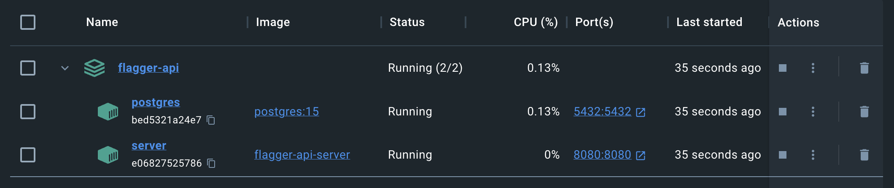

[](https://www.pcrf.net/)

<p align="center">
    
</p>

<p align="center">
    <strong><i>Flagger API</i></strong> is the backend REST API that serves <strong><i>Flagger</i></strong>, the platform that unifies feature flag automation.
</p>

<div align="center">

[](https://github.com/alvii147/flagger-api/actions) [](https://opensource.org/licenses/BSD-3-Clause) [](https://goreportcard.com/report/github.com/alvii147/flagger-api)

</div>

## Installation

### :one: [Install Docker](https://docs.docker.com/engine/install/)

### :two: Run Flagger API

Run the following make command run the flagger API containers:

```bash
make docker-up
```

You should see the following containers up and running:



The `flagger-api-server` container's logs should indicate which port it is running on:

```
[I] 2006/01/02 15:04:05 /app/internal/server/controller.go:102: Server running on 0.0.0.0:8080
```

## Environment Variables

Following is a list of available overridable environment variables:

Variable | Default | Description
--- | --- | ---
`FLAGGERAPI_HOSTNAME` | `0.0.0.0` | Serving hostname of API
`FLAGGERAPI_PORT` | `8080` | Serving port number of API
`FLAGGERAPI_SECRET_KEY` | `DEADBEEF` | Secret key used for token encryption
`FLAGGERAPI_HASHING_COST` | `14` | Hashing cost for password/key hashing
`FLAGGERAPI_FRONTEND_BASE_URL` | `http://localhost:3000` | Frontend URL, used to generate links in emails
`FLAGGERAPI_FRONTEND_ACTIVATION_ROUTE` | `/signup/activate/%s` | Frontend activation route, used to generate activation link in emails
`FLAGGERAPI_AUTH_ACCESS_LIFETIME` | `30` | Lifetime of access tokens in minutes
`FLAGGERAPI_AUTH_REFRESH_LIFETIME` | `43200` | Lifetime of refresh tokens in minutes
`FLAGGERAPI_ACTIVATION_LIFETIME` | `43200` | Lifetime of activation tokens in minutes
`FLAGGERAPI_POSTGRES_HOSTNAME` | `host.docker.internal` | PostgreSQL hostname
`FLAGGERAPI_POSTGRES_PORT` | `5432` | PostgreSQL port number
`FLAGGERAPI_POSTGRES_USERNAME` | `postgres` | PostgreSQL username
`FLAGGERAPI_POSTGRES_PASSWORD` | `postgres` | PostgreSQL password
`FLAGGERAPI_POSTGRES_DATABASE_NAME` | `flaggerdb` | PostgreSQL database name
`FLAGGERAPI_SMTP_HOSTNAME` | `smtp.gmail.com` | SMTP hostname
`FLAGGERAPI_SMTP_PORT` | `587` | SMTP port number
`FLAGGERAPI_SMTP_USERNAME` | `<empty>` | SMTP email username, used if `FLAGGERAPI_MAIL_CLIENT_TYPE` is `smtp`
`FLAGGERAPI_SMTP_PASSWORD` | `<empty>` | SMTP email password, used if `FLAGGERAPI_MAIL_CLIENT_TYPE` is `smtp`
`FLAGGERAPI_MAIL_CLIENT_TYPE` | `console` | Mail client type, must be one of `smtp`, `console`, or `inmem`

## Testing

To run all unit tests, run the following make command:

```bash
make test
```

Use the `VERBOSE` option to enable verbose test logging:

```bash
VERBOSE=1 make test
```

To run specific tests, specify a regular expression that matches the desired test names using the `REGEX` option:

```bash
REGEX=TestName make test
```

To run unit tests along with the code coverage report, run the following make command:

```bash
make cover
```

## Authentication

### Endpoints

Route | Method | Authentication | Description
--- | --- | --- | ---
`/auth/users` | `POST` | - | Create user
`/auth/users/activate` | `POST` | - | Activate user
`/auth/users/me` | `GET` | JWT | Retrieve current user
`/auth/tokens` | `POST` | - | Create access and refresh JWTs
`/auth/tokens/refresh` | `POST` | - | Refresh JWT
`/auth/api-keys` | `GET` | JWT | List all API keys
`/auth/api-keys` | `POST` | JWT | Create new API key
`/auth/api-keys/:id` | `DELETE` | JWT | Delete API key
`/api/auth/users/me` | `GET` | API Key | Retrieve current user

### Create User

Create a new user using email, password, first name and last name:

```bash
curl \
-X POST \
-d '{"email": "michael.scott@dundermifflin.com", "password": "ideclarebankruptcy", "first_name": "Michael", "last_name": "Scott"}' \
--url "localhost:8080/auth/users"
```

This should returned the details of the created user:

```json
{
    "uuid": "92cf40a4-dfc8-4062-8872-4c390cf52d3b",
    "email": "michael.scott@dundermifflin.com",
    "first_name": "Michael",
    "last_name": "Scott",
    "created_at": "2024-01-27T02:09:27.918253Z"
}
```

### Activate User

Once a user is created, it is in a deactivated state. The user should get an email of the following form:

```
Flagger - Activate Your Account

Glad to have you on board, michael.scott@dundermifflin.com!
Flagger is the platform that unifies feature flag automation.

One last thing we need from you: activate your account! Just click the link below to activate your account:

http://localhost:3000/signup/activate/<activation-token>
```

If `FLAGGERAPI_MAIL_CLIENT_TYPE` is set to `console` (which is the default), the entire email templates should be printed to the console.

To activate the user, extract the activation token from the email template and replace the `<activation-token>` placeholder with it in the following request:

```bash
curl \
-X POST \
-d '{"token": "<activation-token>"}'
--url "localhost:8080/auth/users/activate"
```

### Authenticate User

One created and activated, the user can be authenticated:

```bash
curl \
-X POST \
-d '{"email": "michael.scott@dundermifflin.com", "password": "ideclarebankruptcy"}'
--url "localhost:8080/auth/tokens"
```

This should produce access and refresh tokens in the form of JWTs for the authenticated user:

```json
{
    "access": "<access-token>",
    "refresh": "<refresh-token>"
}
```

The access token can be used in the authorization header to keep the user authenticated:

```bash
curl ... -H "Authorization: Bearer <access-token>"
```

After 5 minutes (or however long `FLAGGERAPI_AUTH_ACCESS_LIFETIME` is set to), the access token will expire and will no longer be usable, after which the refresh token can be used to generate a new access token:

```bash
curl \
-X POST \
-d '{"refresh": "<refresh-token>"}'
--url "localhost:8080/auth/tokens/refresh"
```

This should produce a new access token:

```json
{
    "access": "<access-token>"
}
```

## Retrieve Current User

The currently authenticated user can be retrieved using the access token produced in the last step:

```bash
curl \
-X GET \
-H "Authorization: Bearer <access-token>" \
--url "localhost:8080/auth/users/me"
```

This should return the current user's data:

```json
{
    "uuid": "92cf40a4-dfc8-4062-8872-4c390cf52d3b",
    "email": "michael.scott@dundermifflin.com",
    "first_name": "Michael",
    "last_name": "Scott",
    "created_at": "2024-01-27T02:09:27.918253Z"
}
```

### Create API Key

Besides JWT authentication, Flagger API also supports API key authentication for a subset of endpoints. To create an API key, run:

```bash
curl \
-X POST \
-H "Authorization: Bearer <access-token>" \
-d '{"name": "my api key", "expires_at": "2038-01-19T03:14:07Z"}'
--url "localhost:8080/auth/api-keys"
```

This will create an API key and return the following:

```json
{
    "id": 1,
    "raw_key": "<api-key>",
    "user_uuid": "92cf40a4-dfc8-4062-8872-4c390cf52d3b",
    "name":"my api key",
    "created_at":"2024-01-29T01:40:12.959305Z",
    "expires_at":"2038-01-19T03:14:07Z",
}
```

The raw API key returned can be used to fetch the current user:

```bash
curl \
-X GET \
-H "Authorization: X-API-Key <api-key>"
--url "localhost:8080/api/auth/users/me"
```

Note that the raw API key string will only ever be included in the API key creation response ever, and never again. The raw key is not stored in the database, so a lost API key cannot be recovered.

### List API Keys

To list the current user's API keys, run:

```bash
curl \
-X GET \
-H "Authorization: Bearer <access-token>" \
--url "localhost:8080/auth/api-keys"
```

This should return a list of API keys:

```json
{
    "keys": [
        {
            "id": 1,
            "user_uuid": "92cf40a4-dfc8-4062-8872-4c390cf52d3b",
            "prefix": "<api-key-prefix>",
            "name": "my api key",
            "created_at": "2024-01-29T01:40:12.959305Z",
            "expires_at":"2038-01-19T03:14:07Z"
        }
    ]
}
```

### Delete API Key

To delete an API key, run:

```bash
curl \
-X DELETE \
-H "Authorization: Bearer <access-token>" \
--url "localhost:8080/auth/api-keys/<api-key-id>"
```

Make sure `<api-key-id>` is replaced with the appropriate API key ID.

## Flags

### Endpoints

Route | Method | Authentication | Description
--- | --- | --- | ---
`/flags` | `POST` | JWT | Create flag
`/flags` | `GET` | JWT | List flags
`/flags/:id` | `GET` | JWT | Get flag by ID
`/flags/:id` | `PUT` | JWT | Update flag
`/flags/:name` | `GET` | API Key | Get flag by name
